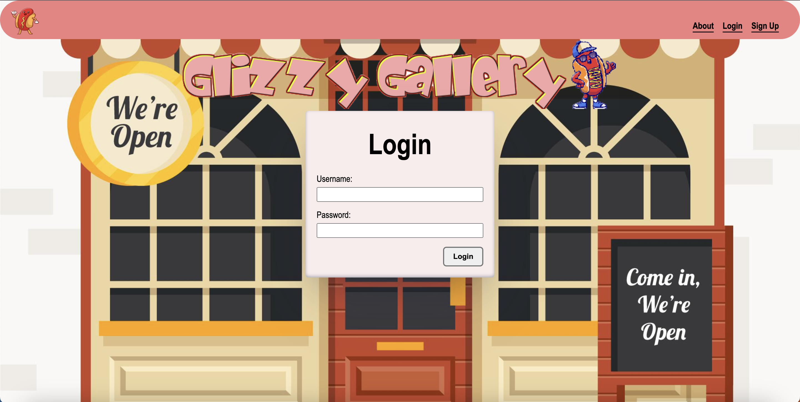
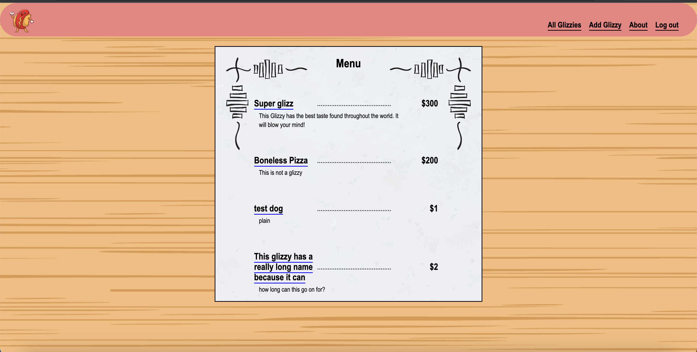

  

# Glizzy Gallery

# Getting Started

  

Click [here](https://glizzy-gallery.fly.dev/) to go to the app!

Click [here](https://github.com/efung7994/glizzy-gallery) to go to the github!

# Background
Glizzy Gallery is a website to create your very own glizzy! What is a glizzy? It's another word for a hot dog! This site uses Python and Django along with other technologies to create a simple CRUD app.

  

# Technologies Used

- Python
- Django
- PostgreSQL
- HTML
- CSS
- Git
- Dockerfile
- Fly.io
- Bit.io

# Attributions

[Stock Photos](https://www.freepik.com/)

[CSS Box Shadows](https://getcssscan.com/css-box-shadow-examples)

  

# Next Steps

- [ ] Create a model for toppings
- [ ] Allow users to share their glizzies
- [ ] Record created toppings in the database so that they can be added by any user